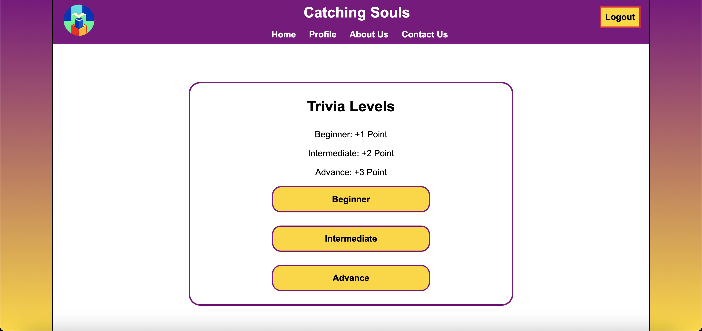

# CatchingSouls
Catching Souls is the ultimate Bible trivia web app designed to deepen your understanding of the Bible while having fun! The mission is to provide an engaging platform where users can test their knowledge, learn new insights, and grow in their faith through interactive quizzes.

In the image below, you will see an option for users to sign in, or play as a guest.

The image below shows you the dashboard after the user signs in.

The image belows shows you the options of levels to choose from and the amount of points each level is.

The images below shows you the questionnaire page, including the correct or incorrect result.

The images below shows you the profile page, the profile update page, and the profile delete page.

The images below shows you the admin controls when you are signed in as an admin.

The mobile web pages are configured as well! Please play as a guest and share your thoughts!